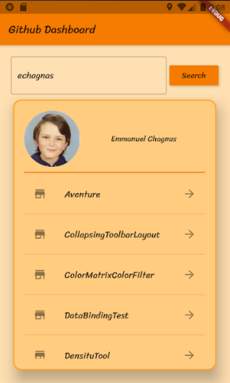
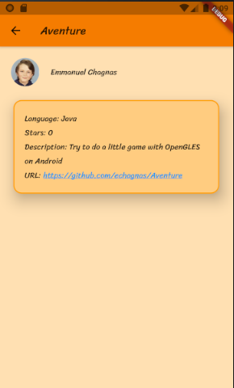

# github_dashboard

A Flutter application to show public repositories on GitHub.

Enter a github username and click the "search" button.

You will see the photo and the name, and  below a list of the public repositories.

Click on a repo to show detail on it.

 

## Getting Started

This repo uses annotations.\
To generate code, use the command : "flutter packages pub run build_runner build".

Check the strings.dart file, and add your github username and a github token (to generate  on github).\
static const username = ""; //Must be changed with your github username.\
static const accesstoken = ""; //Must be changed with your github token.

## Technical features
- Hero animation
- Multi configuration (flavors like)
- Dependency Injection (with get_it lib)
- Clickable links (with link lib)
- HTTP calls (with http lib)
- JSon decode
- Providers
- architecture MVVM
- Generated models (with json_annotation)
- Custom font
- Styles, strings and dimensions in a separate file
- Image from URL
- Icon of application with flutter_icons lib

## BUGS
- A rectangle appears below the card on iOS emulator due to elevation\
